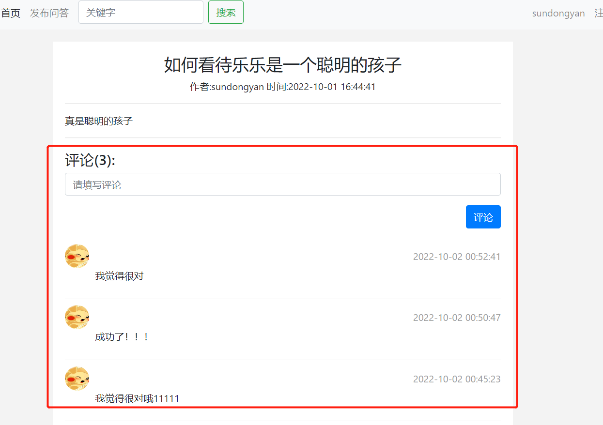

# flask_case_study
Flask learning. To build a QA community.
## 项目介绍：
类似知乎的发布平台，有邮箱注册，发布问题，回答问题功能。各功能截图如下
邮箱注册：

邮箱登录功能：

问题发布：

首页信息（根据时间排序）:

评论功能:


##细节介绍：
[B站学习视频链接](https://www.bilibili.com/video/BV17r4y1y7jJ?p=1&vd_source=6a20bc4ed6d5830e86763ea5ca28f438) 推荐的视频，手把手到入门。

需要安装mysql 和 requirements.txt.
在config.py 
设置自己的邮箱用于发送验证邮件.mysql password

```
flask db init
flask db migrate
flask db upgrade
```
[ORM迁移知识链接](https://www.zlkt.net/book/detail/10/297)

祝你学习开心，有时间后续再更新一下redis等内容！


